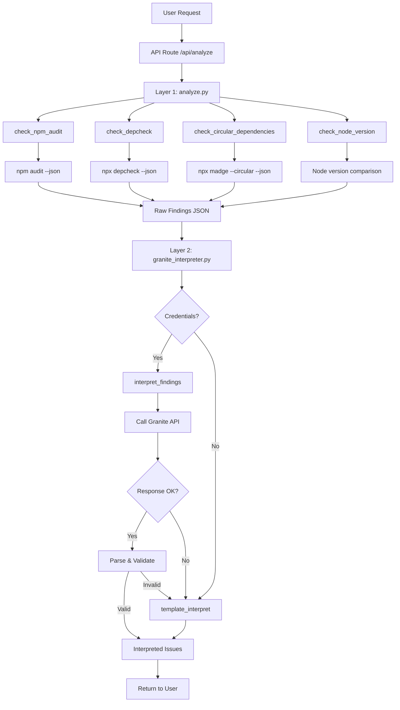
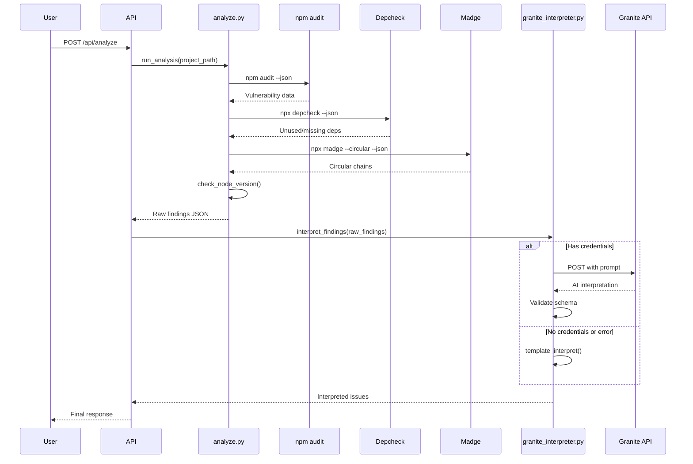
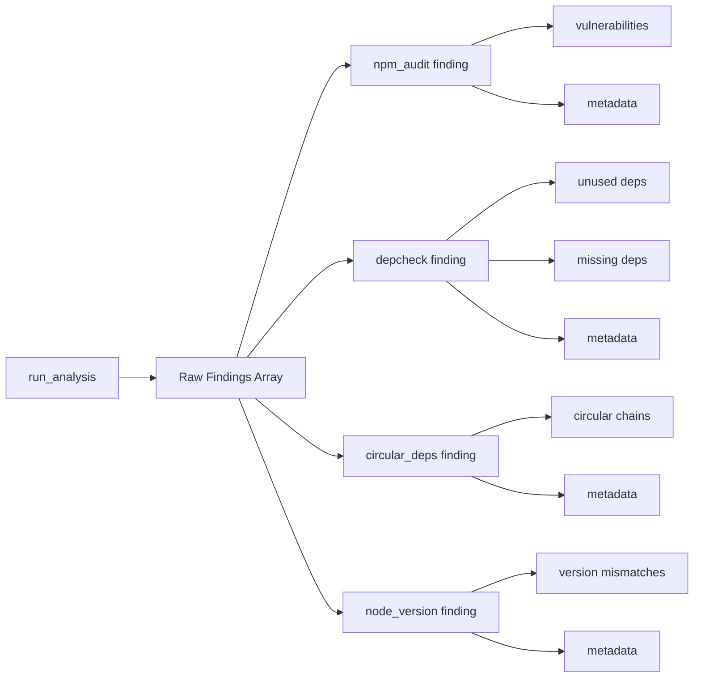
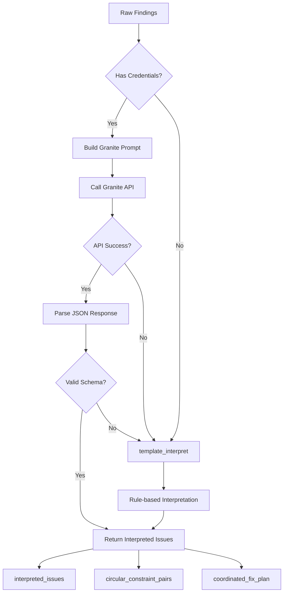
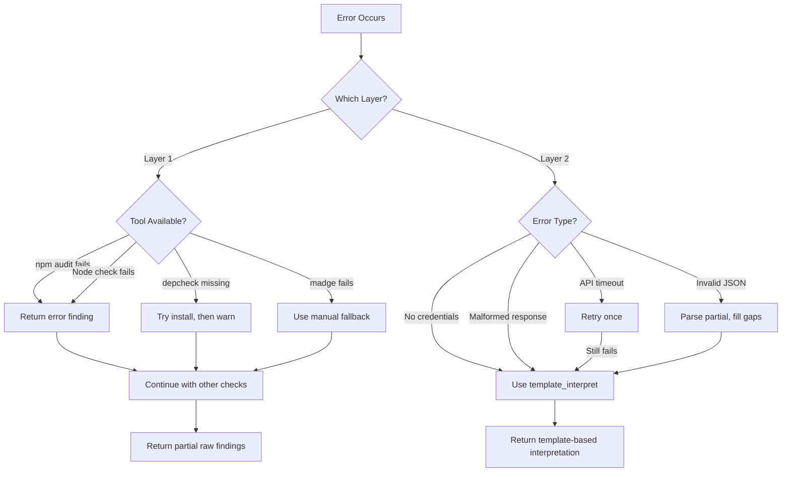

# ZeroLoop Two-Layer Architecture

## System Flow Diagram

## Data Flow

## Layer 1: Raw Findings Structure

## Layer 2: Interpretation Flow

## Component Responsibilities

### Layer 1: analyze.py
- ✅ Execute npm audit
- ✅ Execute depcheck
- ✅ Execute madge (circular deps)
- ✅ Check Node version compatibility
- ✅ Aggregate raw findings
- ❌ NO interpretation
- ❌ NO bobclues
- ❌ NO fix recommendations

### Layer 2: granite_interpreter.py
- ✅ Call Granite API with raw findings
- ✅ Generate bobclues (DO NOT...)
- ✅ Provide explanations
- ✅ Assign severity levels
- ✅ Create fix recommendations
- ✅ Identify circular constraint pairs
- ✅ Generate coordinated fix plan
- ✅ Fallback to template interpretation

## Error Handling Flow

## Key Design Decisions

### 1. Separation of Concerns
- **Layer 1**: Pure data collection (no opinions)
- **Layer 2**: AI-powered interpretation (all opinions)

### 2. Graceful Degradation
- Missing tools → Continue with available tools
- No Granite credentials → Use template fallback
- API errors → Automatic fallback to templates

### 3. Schema Validation
- Layer 1 output: Strict raw findings format
- Layer 2 output: Validated interpretation schema
- Malformed responses: Handled gracefully

### 4. Tool Integration
- npm audit: Native npm command
- depcheck: npx (auto-install if needed)
- madge: Already integrated, keep as-is
- Node version: Pure Python logic

### 5. Backward Compatibility
- Keep old analyze.py as analyze_legacy.py
- Version API endpoints if needed
- Provide migration guide
