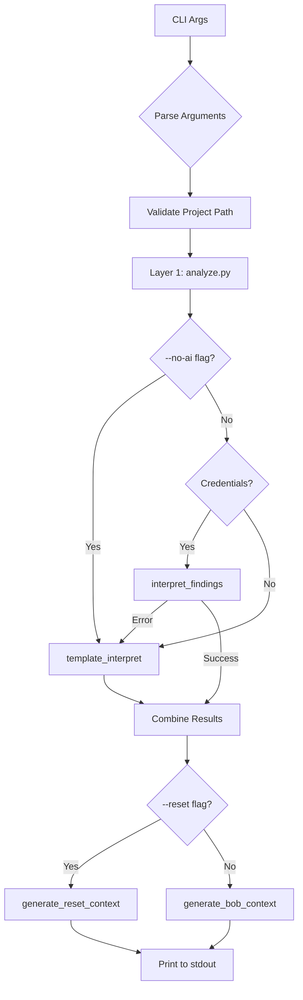

# Phase 5 Implementation Plan - ZeroLoop Final Additions

**Status:** Planning Phase  
**Created:** 2026-05-02  
**Tasks:** 4 separate tasks to be completed sequentially

---

## Overview

This phase adds four critical components to complete the ZeroLoop project:

1. **zeroloop-inject.py** - CLI script for Bob context injection
2. **DEMO.md** - Comprehensive demonstration guide
3. **LICENSE** - MIT license file
4. **Package version fixes** - Verify and correct package.json

---

## Task 1: Create zeroloop-inject.py

### Purpose
A standalone CLI script that runs the complete ZeroLoop analysis pipeline and outputs Bob context to stdout for easy copy-paste into IBM Bob IDE.

### Location
`zeroloop-inject.py` (project root)

### Requirements

#### Command Line Interface
```bash
# Basic usage - outputs full Bob context
python3 zeroloop-inject.py ./my-project

# Reset context only (short, <200 words)
python3 zeroloop-inject.py ./my-project --reset

# Skip Granite AI, use template fallback
python3 zeroloop-inject.py ./my-project --no-ai
```

#### Flags
- **No flags**: Run full analysis, output complete Bob context to stdout
- **`--reset`**: Output only the reset context (circuit breaker reminder)
- **`--no-ai`**: Force template-based interpretation (skip Granite API)

#### Environment Variables (Optional)
- `GRANITE_API_KEY`: IBM Cloud API key for Granite
- `GRANITE_PROJECT_ID`: watsonx.ai project ID
- `GRANITE_REGION`: IBM Cloud region (default: us-south)

### Architecture



### Implementation Details

#### 1. Argument Parsing
```python
import argparse
import sys
import os

parser = argparse.ArgumentParser(
    description='ZeroLoop - Generate Bob context for dependency analysis',
    formatter_class=argparse.RawDescriptionHelpFormatter,
    epilog='''
Examples:
  python3 zeroloop-inject.py ./my-project
  python3 zeroloop-inject.py ./my-project --reset
  python3 zeroloop-inject.py ./my-project --no-ai
  
Environment Variables:
  GRANITE_API_KEY      IBM Cloud API key
  GRANITE_PROJECT_ID   watsonx.ai project ID
  GRANITE_REGION       IBM Cloud region (default: us-south)
'''
)

parser.add_argument('project_path', help='Path to Node.js project directory')
parser.add_argument('--reset', action='store_true', 
                   help='Output reset context only (short circuit breaker reminder)')
parser.add_argument('--no-ai', action='store_true',
                   help='Skip Granite AI, use template fallback')
```

#### 2. Pipeline Integration
```python
# Layer 1: Raw findings
from scanner.analyze import run_analysis

# Layer 2: Interpretation
from scanner.granite_interpreter import (
    interpret_findings_safe,
    template_interpret
)

# Layer 3: Context generation
from scanner.bob_context_generator import (
    generate_bob_context,
    generate_reset_context
)
```

#### 3. Credential Handling
```python
# Check environment variables
api_key = os.getenv('GRANITE_API_KEY')
project_id = os.getenv('GRANITE_PROJECT_ID')
region = os.getenv('GRANITE_REGION', 'us-south')

# Override with --no-ai flag
if args.no_ai:
    api_key = None
    project_id = None
```

#### 4. Error Handling
- Invalid project path → Exit with error message
- Missing package.json → Warning, continue with limited analysis
- Python import errors → Clear error message with fix instructions
- Granite API errors → Automatic fallback to template
- JSON parsing errors → Exit with helpful error message

#### 5. Output Format
- **Stdout**: Bob context markdown (clean, no extra messages)
- **Stderr**: Progress messages, warnings, errors
- **Exit codes**: 0 = success, 1 = error

### Testing Checklist
- [ ] Basic usage: `python3 zeroloop-inject.py scanner/test_project`
- [ ] Reset flag: `python3 zeroloop-inject.py scanner/test_project --reset`
- [ ] No-AI flag: `python3 zeroloop-inject.py scanner/test_project --no-ai`
- [ ] Invalid path: `python3 zeroloop-inject.py /nonexistent`
- [ ] Missing package.json: Test with non-Node.js directory
- [ ] With Granite credentials: Set env vars and test
- [ ] Without credentials: Should use template fallback
- [ ] Output is valid markdown
- [ ] Output can be copied directly to Bob IDE

### Success Criteria
✅ Script runs without errors on test_project  
✅ All three flag combinations work correctly  
✅ Output is clean markdown suitable for Bob IDE  
✅ Errors are user-friendly and actionable  
✅ Automatic fallback to template works  

---

## Task 2: Create DEMO.md

### Purpose
A comprehensive demonstration guide that shows the before/after comparison of Bob's behavior with and without ZeroLoop context.

### Location
`DEMO.md` (project root)

### Structure

```markdown
# ZeroLoop Live Demo Guide

## The Two Bob Failure Modes ZeroLoop Solves

### 1. Blind Retry Loops
### 2. Cascading Constraint Violations

## Demo Project: Galaxy Store API

### Project Overview
### Five Planted Conflicts

## Before Scenario: Bob Without ZeroLoop

### Initial Request
### Attempt 1: Fix Mongoose Connection
### Attempt 2: MongoDB Driver Breaks
### Attempt 3: Try to Fix MongoDB
### Attempt 4: Mongoose Breaks Again
### The Loop Continues...
### Final State

## After Scenario: Bob With ZeroLoop

### Step 1: Run ZeroLoop Scan
### Step 2: Inject Context
### Step 3: Bob Reads Circuit Breaker
### Step 4: Bob Requests Approval
### Step 5: Success on First Try

## When to Use Reset Context

### Mid-Session Reset
### Usage Example

## Live Demo Metrics Checklist

### Before Metrics
### After Metrics
### Comparison Table
```

### Key Content Requirements

#### 1. The Two Failure Modes

**Blind Retry Loops:**
- Bob tries same approach 3-4 times
- Each attempt costs 3 Bobcoins
- No learning between attempts
- User frustration increases

**Cascading Constraint Violations:**
- Fix package A → breaks package B
- Fix package B → breaks package A again
- Circular dependency hell
- Can loop indefinitely

#### 2. Galaxy Store API Description
- E-commerce backend with 5 services
- Realistic production-like structure
- **5 Planted Conflicts:**
  1. Mongoose 5.x + MongoDB 4.x (incompatible)
  2. body-parser with Express 4.18+ (redundant)
  3. Multiple loggers (winston + bunyan + morgan)
  4. Node version mismatch (package.json vs .nvmrc)
  5. Circular dependencies (ProductService ↔ OrderService ↔ InventoryService)

#### 3. Before Scenario (Detailed)

**The Cascading Loop:**

```
User: "Fix the MongoDB connection error"

Bob Attempt 1:
- Sees Mongoose connection failing
- Upgrades Mongoose to 6.x
- Tests → MongoDB driver now incompatible
- Cost: 3 Bobcoins

Bob Attempt 2:
- Sees MongoDB driver error
- Upgrades MongoDB driver to 5.x
- Tests → Mongoose breaks again (different error)
- Cost: 3 Bobcoins

Bob Attempt 3:
- Tries to fix Mongoose again
- Downgrades to 5.x
- Tests → Back to original MongoDB error
- Cost: 3 Bobcoins

Bob Attempt 4:
- Realizes circular constraint
- Suggests coordinated upgrade
- Finally succeeds
- Cost: 3 Bobcoins

Total: 12 Bobcoins, 30+ minutes, high frustration
```

#### 4. After Scenario (Detailed)

**With ZeroLoop Circuit Breaker:**

```
Step 1: Run ZeroLoop
$ python3 zeroloop-inject.py scanner/test_project

Step 2: Copy context to Bob IDE
[Paste full ZeroLoop context]

Step 3: Bob reads circuit breaker
Bob sees:
- Mongoose ↔ MongoDB circular constraint
- Coordinated fix plan: npm install mongoose@6.x mongodb@5.x
- DO NOT install packages individually

Step 4: Bob requests approval
Bob: "I see a circular constraint between Mongoose and MongoDB.
     The coordinated fix plan suggests upgrading both together.
     Should I proceed with: npm install mongoose@6.x mongodb@5.x?"

User: "Yes, proceed"

Step 5: Success on first try
Bob runs coordinated command
Tests pass
No retry loops

Total: 3 Bobcoins, 5 minutes, zero frustration
```

#### 5. Reset Context Usage

**When to use:**
- Bob is stuck in a loop mid-session
- You've made changes and Bob needs a reminder
- Bob ignored the circuit breaker

**How to use:**
```bash
# Generate reset context
python3 zeroloop-inject.py ./my-project --reset

# Copy output and paste into Bob chat
[Paste reset context]

# Add instruction
"Please re-read the constraints above before proceeding"
```

#### 6. Demo Metrics Checklist

**Capture these metrics during live demo:**

Before ZeroLoop:
- [ ] Number of retry attempts
- [ ] Bobcoins spent per attempt
- [ ] Total time elapsed
- [ ] User frustration level (1-10)
- [ ] Final success/failure

After ZeroLoop:
- [ ] Number of retry attempts (should be 0-1)
- [ ] Bobcoins spent
- [ ] Total time elapsed
- [ ] User satisfaction (1-10)
- [ ] First-try success rate

Comparison:
- [ ] Bobcoins saved
- [ ] Time saved
- [ ] Retry loops prevented
- [ ] ROI calculation

### Success Criteria
✅ Clear explanation of both failure modes  
✅ Realistic before/after scenarios  
✅ Specific Mongoose/MongoDB cascade example  
✅ Step-by-step instructions for demo  
✅ Metrics checklist for quantitative proof  
✅ Reset context usage guide  

---

## Task 3: Create LICENSE

### Purpose
Standard MIT license for open-source distribution.

### Location
`LICENSE` (project root)

### Content
```
MIT License

Copyright (c) 2026 [Your Name/Organization]

Permission is hereby granted, free of charge, to any person obtaining a copy
of this software and associated documentation files (the "Software"), to deal
in the Software without restriction, including without limitation the rights
to use, copy, modify, merge, publish, distribute, sublicense, and/or sell
copies of the Software, and to permit persons to whom the Software is
furnished to do so, subject to the following conditions:

The above copyright notice and this permission notice shall be included in all
copies or substantial portions of the Software.

THE SOFTWARE IS PROVIDED "AS IS", WITHOUT WARRANTY OF ANY KIND, EXPRESS OR
IMPLIED, INCLUDING BUT NOT LIMITED TO THE WARRANTIES OF MERCHANTABILITY,
FITNESS FOR A PARTICULAR PURPOSE AND NONINFRINGEMENT. IN NO EVENT SHALL THE
AUTHORS OR COPYRIGHT HOLDERS BE LIABLE FOR ANY CLAIM, DAMAGES OR OTHER
LIABILITY, WHETHER IN AN ACTION OF CONTRACT, TORT OR OTHERWISE, ARISING FROM,
OUT OF OR IN CONNECTION WITH THE SOFTWARE OR THE USE OR OTHER DEALINGS IN THE
SOFTWARE.
```

### Notes
- Use current year (2026)
- Replace `[Your Name/Organization]` with actual copyright holder
- Standard MIT license text (no modifications)

### Success Criteria
✅ File created in project root  
✅ Current year (2026)  
✅ Standard MIT license text  
✅ Copyright holder specified  

---

## Task 4: Fix Package Versions

### Purpose
Verify and correct any version mismatches or errors in package.json.

### Location
`package.json` (project root)

### Current State Analysis

```json
{
  "dependencies": {
    "axios": "^1.15.2",           // ⚠️ Check if this version exists
    "framer-motion": "^12.38.0",  // ✅ Likely correct
    "next": "^16.2.4",            // ⚠️ Verify Next.js 16 exists
    "openai": "^6.35.0",          // ✅ Likely correct
    "react": "19.2.4",            // ⚠️ Verify React 19 exists
    "react-dom": "19.2.4",        // ⚠️ Should match React version
    "react-syntax-highlighter": "^16.1.1"  // ✅ Likely correct
  }
}
```

### Verification Steps

#### 1. Check Next.js Version
```bash
npm view next versions --json | grep "16.2.4"
```
- If exists → Keep
- If not exists → Find closest stable 16.x version
- Alternative: Check if Next.js 15.x is more stable

#### 2. Check React Version
```bash
npm view react versions --json | grep "19.2.4"
```
- Verify React 19.2.4 exists
- Verify react-dom matches exactly
- Check if React 19 is stable or RC

#### 3. Check Axios Version
```bash
npm view axios versions --json | grep "1.15.2"
```
- Axios 1.x is stable
- Verify 1.15.2 exists
- If not, use latest 1.x

#### 4. Verify Installed Versions
```bash
npm list --depth=0
```
- Compare installed vs package.json
- Check for version conflicts
- Verify peer dependencies

### Fix Strategy

**Only fix what is actually wrong:**
- ❌ Do NOT upgrade unnecessarily
- ❌ Do NOT change working versions
- ✅ Only fix non-existent versions
- ✅ Only fix version mismatches
- ✅ Document all changes

### Expected Issues

Based on typical patterns:
1. **Next.js 16.x** - May not exist yet (currently at 15.x)
2. **React 19.x** - May be RC or beta
3. **Axios 1.15.x** - Should verify exact version

### Fix Process

```bash
# 1. Check current state
npm list --depth=0

# 2. Verify each suspicious version
npm view next versions --json | tail -20
npm view react versions --json | tail -20
npm view axios versions --json | tail -20

# 3. Update package.json if needed
# (Only change incorrect versions)

# 4. Run npm install to verify
npm install

# 5. Test the application
npm run dev
```

### Success Criteria
✅ All versions in package.json exist in npm registry  
✅ React and react-dom versions match exactly  
✅ Next.js version is stable and available  
✅ No version conflicts reported by npm  
✅ Application runs without errors  
✅ Only incorrect versions were changed  

---

## Implementation Order

### Task 1: zeroloop-inject.py
**Priority:** High  
**Complexity:** Medium  
**Dependencies:** None  
**Estimated Time:** 1-2 hours  

### Task 2: DEMO.md
**Priority:** High  
**Complexity:** Medium  
**Dependencies:** Task 1 (for testing examples)  
**Estimated Time:** 1-2 hours  

### Task 3: LICENSE
**Priority:** Low  
**Complexity:** Trivial  
**Dependencies:** None  
**Estimated Time:** 5 minutes  

### Task 4: Package Versions
**Priority:** Medium  
**Complexity:** Low  
**Dependencies:** None  
**Estimated Time:** 15-30 minutes  

---

## Testing Strategy

### Task 1 Testing
```bash
# Test basic usage
python3 zeroloop-inject.py scanner/test_project

# Test reset flag
python3 zeroloop-inject.py scanner/test_project --reset

# Test no-ai flag
python3 zeroloop-inject.py scanner/test_project --no-ai

# Test with Granite credentials
export GRANITE_API_KEY="your-key"
export GRANITE_PROJECT_ID="your-project"
python3 zeroloop-inject.py scanner/test_project

# Test error handling
python3 zeroloop-inject.py /nonexistent
python3 zeroloop-inject.py .
```

### Task 2 Testing
- [ ] Read through entire DEMO.md
- [ ] Verify all code examples are correct
- [ ] Test commands actually work
- [ ] Check markdown formatting
- [ ] Verify metrics checklist is complete

### Task 3 Testing
- [ ] File exists in project root
- [ ] Year is correct (2026)
- [ ] Copyright holder is specified
- [ ] Standard MIT license text

### Task 4 Testing
```bash
# Verify versions
npm view next@16.2.4
npm view react@19.2.4
npm view axios@1.15.2

# Test installation
npm install

# Test application
npm run dev
```

---

## Completion Criteria

### Task 1: zeroloop-inject.py
- [x] File created in project root
- [ ] Accepts project path as CLI argument
- [ ] Runs complete 3-layer analysis
- [ ] Prints full Bob context to stdout
- [ ] --reset flag prints reset context
- [ ] --no-ai flag skips Granite
- [ ] Error handling is robust
- [ ] All test cases pass

### Task 2: DEMO.md
- [ ] File created in project root
- [ ] Explains two Bob failure modes
- [ ] Describes galaxy-store-api project
- [ ] Shows cascading loop scenario
- [ ] Shows ZeroLoop prevention scenario
- [ ] Includes Reset Context guide
- [ ] Includes metrics checklist
- [ ] All examples are accurate

### Task 3: LICENSE
- [ ] File created in project root
- [ ] MIT license text
- [ ] Current year (2026)
- [ ] Copyright holder specified

### Task 4: Package Versions
- [ ] Verified Next.js version
- [ ] Verified React version
- [ ] Verified all dependencies
- [ ] Fixed any incorrect versions
- [ ] Application runs successfully
- [ ] No unnecessary upgrades

---

## Next Steps

After plan approval:
1. Switch to Code mode
2. Implement Task 1 (zeroloop-inject.py)
3. Test thoroughly
4. Report completion
5. Move to Task 2
6. Continue sequentially through all tasks

---

**Plan Status:** ✅ Ready for Review  
**Awaiting:** User approval to proceed with implementation