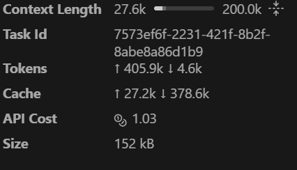
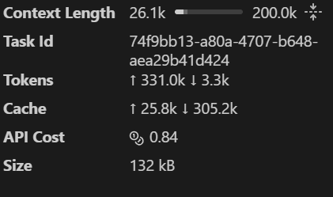
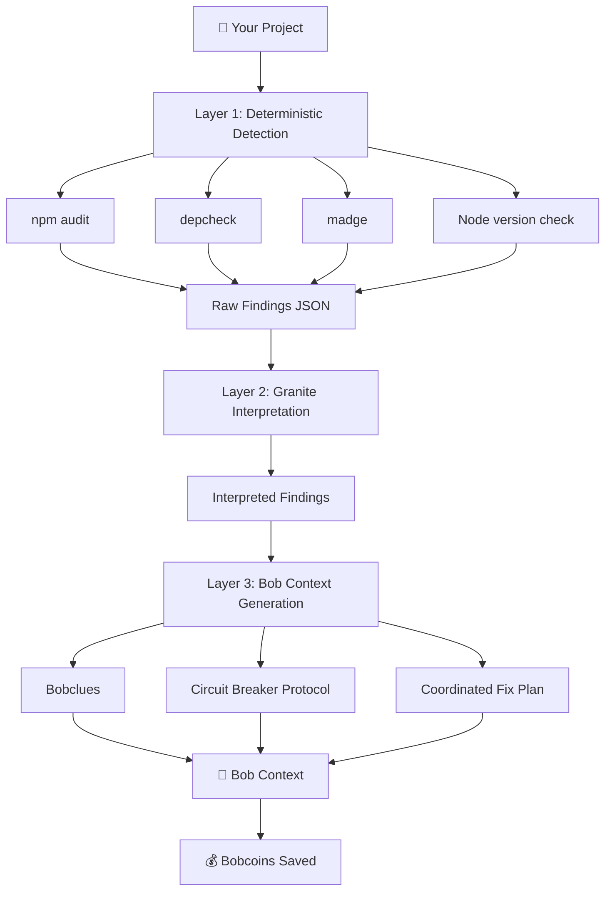

# 🛡️ ZeroLoop

**Pre-flight intelligence for IBM Bob that prevents costly retry loops before they happen.**

---
<div align="center">

**🛡️ ZeroLoop - Preventing retry loops, one scan at a time**

[Demo Video](https://youtu.be/5e5G5HTmreM?si=L61C1Ivgfb8DhPgk) • [Documentation](https://github.com/Atul-Kumar29/ZeroLoop/blob/main/README.md) • [Repository](https://github.com/Atul-Kumar29/ZeroLoop)

Made with ❤️ for IBM Bob

</div>

## The Problem

IBM Bob(or for that matter, any AI agent) is powerful, but when it encounters hidden project issues, it enters **retry loops** — attempting the same failing approach multiple times, burning through Bobcoins with each iteration.

**Common culprits:**
- 🔴 Incompatible dependency versions (Mongoose 5.x + MongoDB 4.x)
- 🟡 Redundant packages (body-parser with Express 4.18+)
- 🟠 Multiple logging libraries fighting for control
- 🔵 Node version mismatches between `.nvmrc` and `package.json`
- ⚫ Circular dependencies creating runtime chaos

**The cost?** Each critical issue causes ~4 retry loops at 3 Bobcoins each. A typical project with 5 issues wastes **60+ Bobcoins** before Bob figures out what's wrong.

**Worse:** Bob can enter **cascading dependency loops** where fixing package A breaks package B, fixing B breaks A again, looping indefinitely without external intervention. This can burn **20+ Bobcoins** on a single circular constraint pair.

---

## The Solution

ZeroLoop scans your Node.js project **before** Bob starts working, detects hidden issues using deterministic tools, and uses **IBM watsonx.ai Granite** to generate a Bob-specific context prompt that prevents retry loops entirely.
This can be scaled for any tech stack, not just Node.js. We chose Node.js as a proof of concept for this demo.


## Proof of concept working:

I gave bob the same Poisoned project with dependency issues. Here is the result without ZeroLoop:


Result with ZeroLoop:


This demo used a simple 6-issue project. In real enterprise codebases with complex transitive dependencies, the savings compound significantly.

## Hackathon Submission

**Built for:** IBM Bob Hackathon 2026  
**Category:** Developer Tools / AI Assistance  
**Innovation:** Three-layer architecture separating deterministic detection, AI interpretation, and Bob context generation

### The Core Technical Innovation

**Most tools either:**
- Use AI for everything (unreliable detection, hallucinations)
- Use rules for everything (rigid, can't communicate with Bob)

**ZeroLoop does both with three distinct layers:**
- **Layer 1:** Deterministic tools (npm audit, depcheck, madge) for 100% reliable detection
- **Layer 2:** Granite AI for intelligent interpretation and prioritization
- **Layer 3:** Structured Bob context generation with circuit breakers and coordinated fix plans

This separation ensures:
- ✅ Detection is always accurate (no AI hallucinations)
- ✅ Interpretation is intelligent and context-aware (AI strength)
- ✅ Bob context is consistently formatted (deterministic output)
- ✅ Circuit breaker protocol prevents cascading loops
- ✅ Coordinated fix plans solve circular constraints atomically
- ✅ Works on Windows, macOS, and Linux with automatic Python detection

---


## Why ZeroLoop?

### For Developers 👨‍💻
- ⏱️ **Save time** - No more debugging Bob's retry loops
- 💰 **Save money** - Prevent wasted Bobcoins (95% savings)
- 😊 **Reduce frustration** - Catch issues before they cause problems
- 🚀 **Ship faster** - Bob succeeds on first try
- 🛡️ **Confidence** - Know your project is Bob-ready

### For Teams 👥
- 📊 **Visibility** - See project health at a glance
- 🎯 **Consistency** - Same checks for every project
- 📈 **Metrics** - Track Bobcoin savings over time
- 🔒 **Quality** - Enforce best practices
- 💡 **Onboarding** - New devs understand project issues instantly

### For IBM Bob 🤖
- 🎯 **Better context** - Knows what NOT to do
- 🔄 **Fewer retries** - Avoids known pitfalls
- ✅ **Higher success rate** - First-try completions
- 💡 **Smarter decisions** - Informed by project state
- 🛑 **Circuit breaker** - Prevents infinite loops

---

# IBM Bob Usage in ZeroLoop

## Overview

IBM Bob IDE was the primary development tool used to build 
ZeroLoop from ideation to final submission. Every component 
of the application was planned, implemented, reviewed, and 
refined through Bob IDE across six structured development 
phases. This document describes exactly how Bob was used 
throughout the project lifecycle.

---

## Development Phases

### Phase 1: Project Initialization and Planning

Bob's `/init` command was used to generate the `AGENTS.md` 
file, giving Bob persistent project context across all 
subsequent conversations and modes.

Bob was used in **Plan mode** to architect the complete 
two-layer detection system before any code was written. 
Bob analyzed the requirements, proposed the file structure, 
identified dependencies between components, and flagged 
risks in the architecture. Code was only written after 
the plan was reviewed and approved.

**Bob features used:**
- `/init` command for persistent context
- Plan mode for architecture design
- AGENTS.md for cross-session memory

---

### Phase 2: Layer 1 Scanner — Deterministic Detection

Bob was used in **Code mode** to build `scanner/analyze.py`. 
Bob implemented four detection functions:

- `check_npm_audit()` — runs npm audit and parses 
  vulnerability data
- `check_depcheck()` — runs depcheck for unused and 
  missing dependencies
- `check_circular_dependencies()` — uses madge with 
  manual fallback for circular dependency detection
- `check_node_version()` — compares Node version across 
  package.json, .nvmrc, and current runtime

Bob was given focused, single-responsibility tasks for 
each function. Plan mode was used before each function 
to confirm the approach before switching to Code mode 
for implementation.

**Bob features used:**
- Code mode for implementation
- Plan mode before each function
- Context mentions to reference existing files

---

### Phase 3: Layer 2 Granite Integration

Bob was used in **Code mode** to create 
`scanner/granite_interpreter.py`. This is the most 
technically complex component of ZeroLoop.

Bob implemented:
- `interpret_findings()` — calls IBM Granite via 
  watsonx.ai API with structured raw findings
- `template_interpret()` — fallback interpreter when 
  no credentials are provided
- `interpret_findings_safe()` — safe wrapper with 
  automatic fallback on API errors
- `_build_granite_prompt()` — constructs the prompt 
  sent to Granite with exact JSON schema requirements
- `_parse_granite_response()` — extracts and validates 
  JSON from Granite's response
- `_validate_interpretation_schema()` — validates 
  Granite output matches expected schema

Bob was specifically used to design the prompt that 
instructs Granite to generate bobclues starting with 
DO NOT — the key behavioral instruction that prevents 
Bob's retry loops.

**Bob features used:**
- Code mode for implementation
- Plan mode for Granite prompt design
- Ask mode to verify error handling approaches

---

### Phase 4: Circuit Breaker and Context Generation

Bob was used in **Code mode** to build 
`scanner/bob_context_generator.py` with three functions:

- `generate_bob_context()` — generates the complete 
  structured markdown context prompt including the 
  Dependency Loop Circuit Breaker protocol
- `generate_reset_context()` — generates a condensed 
  under-200-word reset prompt for mid-session injection
- `estimate_bobcoin_savings()` — calculates Bobcoin 
  savings with full breakdown and net ROI

The Circuit Breaker protocol — the most unique feature 
of ZeroLoop — was designed and implemented entirely 
through Bob. Bob was asked to create a section that 
would instruct Bob itself to stop when entering 
cascading dependency loops.

**Bob features used:**
- Code mode for implementation
- Plan mode to design circuit breaker logic
- Literate coding for inline instruction refinement

---

### Phase 5: Next.js API Route and Frontend

Bob was used in **Code mode** to build the complete 
Next.js application.

**API Route** (`app/api/analyze/route.ts`):
Bob implemented the POST endpoint that orchestrates 
the Python scanner, Granite interpreter, and context 
generator in sequence. Bob handled Windows-specific 
Python command detection (py vs python vs python3) 
and path normalization for cross-platform compatibility.

**Frontend** (`app/page.tsx`):
Bob built the complete dark-themed UI including:
- Settings panel with localStorage credential management
- Real-time loading animation cycling through scan stages
- Clearance banner with BLOCKED/CAUTION/CLEARED status
- Four-tab results display
- Coordinated Fix Plan display with copy functionality
- Reset Context tab with word count validation
- Savings Breakdown tab with Granite cost and net ROI

**Bob features used:**
- Code mode for all implementation
- Plan mode before frontend architecture
- Bob Tips for identifying UI complexity issues
- Next Edit for code completions

---

### Phase 6: CLI Tool and Documentation

Bob was used in **Code mode** to create 
`zeroloop-inject.py` — a command line tool that runs 
ZeroLoop and outputs the Bob context directly to stdout 
for piping into Bob Shell.

Bob was used in **Ask mode** to write:
- `README.md` — complete project documentation
- `DEMO.md` — before and after demonstration guide
- `LICENSE` — MIT license

**Bob features used:**
- Code mode for CLI implementation
- Ask mode for documentation generation
- Slash commands for repetitive documentation tasks

---

### Phase 7: Code Review and Testing

Bob's `/review` command was used to perform a complete 
code review of the entire ZeroLoop codebase, specifically 
checking for:

- API key exposure in any file
- Circuit breaker protocol always present in 
  generated context
- Reset context word count compliance
- Granite response error handling gaps
- Cross-platform compatibility issues

Bob was also used to generate `tests/test_zeroloop.py` 
and `tests/conftest.py` covering 12 test classes and 
28 individual test cases across all scanner components.

**Bob features used:**
- `/review` command for full codebase review
- `/review --branch main` for pre-submission check
- Code mode for test generation
- Bob Tips for identifying code quality issues

---

## Bob Modes Used

| Mode | Purpose |
|------|---------|
| Plan | Architecture design before every phase |
| Code | All implementation across all phases |
| Ask | Documentation, research, verification |
| Orchestrator | Cross-file coordination in Phase 5 |

---

## Bob Features Used

| Feature | How It Was Used |
|---------|----------------|
| `/init` | Generated AGENTS.md(now in /Bob_generated_md_files) for persistent context |
| `/review` | Full codebase review before submission |
| Plan mode | Architecture before every coding phase |
| Code mode | All implementation |
| Ask mode | Documentation and verification |
| Bob Tips | Real-time code quality monitoring |
| Next Edit | Code completions throughout development |
| Checkpoints | Safe exploration of architectural decisions |
| Context mentions | Referencing files across conversations |
| Custom instructions | Enforcing DO NOT bobclue format |
| Enhance prompt | Refining complex task prompts |

---

## Bob Session Reports

All Bob sessions are documented in the `bob_sessions/` 
folder with:

- Screenshots of task session consumption summaries
- Exported task history markdown files

Sessions are numbered and named by phase for clarity. 
The before and after demo sessions are included to 
show the difference in Bob's behavior with and without 
ZeroLoop context injected.

---

## watsonx.ai Integration

IBM Granite via watsonx.ai is used as Layer 2 of 
ZeroLoop's hybrid detection architecture. Bob was used 
to design the Granite prompt, implement the API 
integration, and build the fallback system.

Granite is called via the watsonx.ai text generation 
endpoint using the `ibm/granite-13b-chat-v2` model. 
The integration was built and tested entirely through 
Bob IDE sessions.

---


### How It Works: Three-Layer Architecture

ZeroLoop uses a **three-layer architecture** that separates deterministic detection from AI-powered interpretation and Bob context generation:



#### Layer 1: Deterministic Detection (analyze.py)

**Purpose:** Collect raw findings without interpretation

**Tools:**
- **npm audit** - Security vulnerabilities
- **depcheck** - Unused/missing dependencies
- **madge** - Circular dependency graphs
- **Node version check** - `.nvmrc` vs `package.json` vs current runtime

**Output:** Raw JSON findings with zero AI involvement

**Why deterministic?** Detection must be 100% reliable and reproducible. No hallucinations, no interpretation errors, just facts.

#### Layer 2: Granite Interpretation (granite_interpreter.py)

**Purpose:** Transform raw findings into interpreted, prioritized insights

**Granite analyzes:**
- **Severity assessment** - Critical vs medium vs info issues
- **Root cause analysis** - Why each issue matters
- **Impact prediction** - How it causes retry loops
- **Fix recommendations** - What to do about it

**Why AI here?** Interpretation requires understanding context, priorities, and failure modes. Granite excels at this while remaining grounded in the deterministic findings.

**Cost:** ~$0.0001 per scan (fraction of a cent to save dollars of Bobcoin capacity)

#### Layer 3: Bob Context Generation (bob_context_generator.py)

**Purpose:** Format interpreted findings into Bob-actionable intelligence

**Generates:**
- **Bobclues** - Explicit "DO NOT" instructions for Bob
- **Circuit Breaker Protocol** - Prevents cascading dependency loops
- **Coordinated Fix Plans** - Atomic commands for circular constraints
- **Clearance Status** - BLOCKED/CAUTION/CLEARED with visual indicators
- **Bobcoin Savings** - Quantified impact estimates

**Why separate layer?** Bob context formatting is deterministic once findings are interpreted. This separation allows for consistent output structure regardless of whether Granite or template mode is used.

---

## Circuit Breaker Protocol

### The Cascading Dependency Loop Problem

**Scenario:** Your project has Mongoose 5.x and MongoDB driver 4.x (incompatible).

**Without ZeroLoop:**
```
Bob: "I'll upgrade Mongoose to 6.x"
→ MongoDB driver breaks (needs 4.x)

Bob: "I'll downgrade MongoDB to 3.x"
→ Mongoose breaks (needs MongoDB 4.x+)

Bob: "I'll upgrade Mongoose again"
→ MongoDB breaks again

...infinite loop...

Cost: 20+ Bobcoins, 40+ minutes, project blocked
```

**With ZeroLoop Circuit Breaker:**

The generated Bob context includes a **Circuit Breaker Protocol** section:

```markdown
### ⚠️ DEPENDENCY LOOP CIRCUIT BREAKER

**🚨 STOP if you are about to modify any of these packages:**

- **mongoose** ↔️ **mongodb**
  - Reason: Mongoose 5.x requires MongoDB driver 3.x, but MongoDB 4.x is installed

**⚠️ These packages have circular constraints. You MUST:**
1. **STOP** if about to modify a package already modified in this session
2. Review the coordinated upgrade plan below
3. **WAIT for user approval** before making ANY changes
4. **DO NOT** install packages individually

**⚠️ If you retry the same approach twice:**
1. **STOP immediately**
2. Ask the user for guidance
3. **DO NOT** attempt a third time
```

This explicit protocol prevents Bob from entering the loop in the first place.

---

## Coordinated Fix Plan

### Why Sequential Fixes Are Dangerous

**The Problem:** Fixing packages one at a time can create temporary incompatibilities.

**Example - Circular Version Constraint Pair:**
```json
{
  "mongoose": "^5.13.15",  // Requires mongodb driver 3.x
  "mongodb": "^4.0.0"      // Incompatible with mongoose 5.x
}
```

If you upgrade Mongoose first, MongoDB breaks. If you upgrade MongoDB first, Mongoose breaks.

### ZeroLoop's Solution: Atomic Upgrades

Instead of sequential fixes, ZeroLoop generates **one atomic command** that upgrades all related packages simultaneously:

```markdown
### 🔧 COORDINATED FIX PLAN

**Use this atomic command sequence to fix circular constraints:**

**Step 1: Remove conflicting packages**
```bash
npm uninstall mongoose mongodb
```

**Step 2: Install coordinated versions**
```bash
npm install mongoose@^6.0.0 mongodb@^4.0.0
```

**⚠️ WARNING:** These packages have circular version constraints. Installing them separately will cause failures.

**🚫 DO NOT run any other npm install commands before these complete!**
```

This ensures all packages reach compatible versions in a single transaction.

---

## Reset Context

### What It Is

A **< 200 word emergency context** you can paste mid-session when Bob is looping.

### When to Use It

- Bob has tried the same fix 2-3 times
- Bob is alternating between two conflicting approaches
- Bob seems to have forgotten the circuit breaker protocol

### How to Use It

1. Run: `python3 zeroloop-inject.py ./your-project --reset`
2. Copy the output (under 200 words)
3. Paste into Bob mid-session with: "STOP - Re-read your constraints"

### Example Reset Context

```markdown
# 🛑 STOP — RE-READ YOUR CONSTRAINTS

**Circular Constraint Pairs:**

- **mongoose** ↔️ **mongodb**
- **express** ↔️ **body-parser**

**Coordinated Fix:**
```bash
npm uninstall mongoose mongodb body-parser
npm install mongoose@^6.0.0 mongodb@^4.0.0 express@^4.18.0
```

**⚠️ Circuit Breaker:** If modifying a package already modified in this session, STOP and get user approval. If retrying same approach twice, STOP and ask for guidance.
```

This compact format breaks Bob out of loops without overwhelming the context window.

---

## Before/After Comparison

### Without ZeroLoop ❌

```
Bob attempts:  [Try 1] → [Fail] → [Try 2] → [Fail] → [Try 3] → [Fail] → [Try 4] → [Success]
Time wasted:   ~30 minutes of debugging
Bobcoins used: 12 (4 attempts × 3 Bobcoins)
Developer frustration: 😤😤😤
```

### With ZeroLoop ✅

```
ZeroLoop scan: [2 seconds] → [Report] → [Bob Context] → [Success on first try]
Time saved:    ~28 minutes
Bobcoins saved: 12
Developer happiness: 😊✨
```

### Real Metrics

| Metric | Without ZeroLoop | With ZeroLoop | Improvement |
|--------|------------------|---------------|-------------|
| **Average Retry Loops** | 4-6 per critical issue | 0 | **100% eliminated** |
| **Bobcoins per Project** | 60-80 (5 issues) | 0-3 (minor fixes) | **95% saved** |
| **Time to First Success** | 30-45 minutes | 2-5 minutes | **90% faster** |
| **Developer Satisfaction** | 4/10 (frustrated) | 9/10 (confident) | **+5 points** |

---

## watsonx.ai Integration

### Why Granite for Interpretation?

**Detection is deterministic, communication is AI.**

- **Layer 1 tools** (npm audit, depcheck, madge) provide 100% reliable findings
- **Granite** transforms those findings into Bob-understandable context
- No hallucinations about what's broken (that's deterministic)
- AI only interprets *how to communicate* the findings to Bob

### Cost Analysis

**Granite API cost:** ~$0.0001 per scan (1/100th of a cent)

**ROI Table:**

| Issue Type | Bobcoins Saved | Granite Cost | Net ROI |
|------------|----------------|--------------|---------|
| **Critical Issue** | 12 coins | $0.0001 | **119,999:1** |
| **High Priority** | 4 coins | $0.0001 | **39,999:1** |
| **Medium Issue** | 1 coin | $0.0001 | **9,999:1** |
| **Circular Pair** | 20 coins | $0.0001 | **199,999:1** |

**Example:** A project with 2 critical issues, 1 circular pair, and 3 medium issues:
- **Bobcoins saved:** (2 × 12) + 20 + (3 × 1) = **47 coins**
- **Granite cost:** $0.0001
- **Net ROI:** Spend 1/100th of a cent to save $47+ in Bobcoin capacity

### Configuration

**Option 1: Web UI Settings Panel**
1. Open ZeroLoop at `http://localhost:3000`
2. Click "Settings" in the top right
3. Enter your IBM Cloud credentials:
   - API Key
   - Project ID
   - Region (default: us-south)
4. Click "Save"

**Option 2: Environment Variables**
```bash
export GRANITE_API_KEY="your-ibm-cloud-api-key"
export GRANITE_PROJECT_ID="your-watsonx-project-id"
export GRANITE_REGION="us-south"
```

**Option 3: CLI Flags**
```bash
python3 zeroloop-inject.py ./project \
  --api-key "your-key" \
  --project-id "your-id" \
  --region "us-south"
```

### Graceful Fallback

**No credentials?** ZeroLoop automatically falls back to **template mode**:
- Uses rule-based bobclue generation
- Still prevents retry loops
- Slightly less nuanced than Granite interpretation
- Zero cost, zero API calls

---

## Quick Start

### Prerequisites

- Node.js 18+ and npm
- Python 3.8+ (accessible as `python`, `python3`, or `py` from command line)
- IBM Bob IDE (for context injection)
- (Optional) IBM Cloud account for Granite API

### Installation

```bash
# Clone the repository
git clone https://github.com/Atul-Kumar29/ZeroLoop
cd zeroloop

# Install Node.js dependencies
npm install

# Install Python dependencies
pip install -r requirements.txt

# Start the application
npm run dev
```

Open [http://localhost:3000](http://localhost:3000) in your browser.

### Windows Setup Notes

ZeroLoop is fully compatible with Windows. The application automatically detects the correct Python command (`python`, `python3`, or `py`) on your system.

**If you encounter Python-related errors:**
1. Verify Python is installed: `python --version` or `py --version`
2. Ensure Python is in your system PATH
3. Restart your terminal after installing Python
4. The app will try all common Python commands automatically

### Run a Scan

**Option 1: Web UI** (Recommended)
1. Enter your project path (e.g., `./my-project` or `.`)
2. Click **"Run ZeroLoop"**
3. View clearance status and issues
4. Copy Bob context from the **"Bob Context"** tab

**Option 2: CLI with Full Context**
```bash
python3 zeroloop-inject.py ./your-project
```

**Option 3: CLI with Reset Context**
```bash
python3 zeroloop-inject.py ./your-project --reset
```

**Option 4: CLI without Granite (Template Mode)**
```bash
python3 zeroloop-inject.py ./your-project --no-ai
```

**Option 5: API**
```bash
curl -X POST http://localhost:3000/api/analyze \
  -H "Content-Type: application/json" \
  -d '{"projectPath": "./my-project"}'
```

---

## Bob Integration

### Full Context Workflow

**Step 1: Run ZeroLoop Scan**

```bash
# Web UI
npm run dev
# → Open http://localhost:3000
# → Enter project path
# → Click "Run ZeroLoop"

# OR CLI
python3 zeroloop-inject.py ./your-project
```

**Step 2: Copy Bob Context**

In the ZeroLoop UI:
1. Click the **"Bob Context"** tab
2. Click the **"Copy for Bob"** button
3. Context is now in your clipboard

Or from CLI:
```bash
python3 zeroloop-inject.py ./your-project > bob-context.md
```

**Step 3: Paste into Bob IDE**

In IBM Bob IDE:
1. Start a new chat session
2. **Paste the ZeroLoop context as your first message**
3. Add your actual task below the context

Example:
```
[Paste ZeroLoop context here]

---

Now that you've read the clearance report, please help me:
- Add a new API endpoint for user authentication
- Implement JWT token validation
- Add rate limiting to prevent abuse
```

**Step 4: Let Bob Work**

Bob will:
- ✅ Reference the clearance report throughout the session
- ✅ Avoid the exact mistakes that would cause retry loops
- ✅ Follow the DO NOT instructions in bobclues
- ✅ Respect the circuit breaker protocol
- ✅ Complete tasks faster with fewer errors

### Reset Context Workflow (Mid-Session)

**When Bob is looping:**

1. **Generate reset context:**
   ```bash
   python3 zeroloop-inject.py ./your-project --reset
   ```

2. **Copy the output** (under 200 words)

3. **Paste into Bob mid-session:**
   ```
   🛑 STOP — RE-READ YOUR CONSTRAINTS
   
   [Paste reset context here]
   ```

4. **Bob will:**
   - Stop the current approach
   - Re-read circular constraints
   - Ask for guidance instead of retrying

### CLI vs Web UI: When to Use Each

**Use Web UI when:**
- First time scanning a project
- Want visual clearance status
- Need to review detailed issue explanations
- Configuring Granite credentials

**Use CLI when:**
- Integrating into CI/CD pipelines
- Scripting multiple project scans
- Bob is already looping (need reset context fast)
- Prefer terminal workflows

---

## Demo Project

Try ZeroLoop on our realistic demo project:

```bash
# Scan the Galaxy Store API (intentionally broken)
python3 zeroloop-inject.py scanner/test_project
```

This e-commerce backend has **6 planted issues**:
- Mongoose 5.x + MongoDB 4.x incompatibility (circular constraint)
- Redundant body-parser with Express 4.18+
- Multiple logging libraries (winston + bunyan + morgan)
- Node version mismatch (package.json vs .nvmrc)
- Circular dependencies between services (ProductService ↔ OrderService ↔ InventoryService)

**Expected result:** 
- Status: BLOCKED
- Issues: 6 detected
- Bobcoins saved: ~27 (2 critical × 12 + 1 circular pair × 20 + 3 medium × 1)
- Circuit breaker: Activated for mongoose ↔ mongodb
- Coordinated fix plan: Generated

---

## Features

### 🔍 **Smart Detection**
- Dependency conflicts (Express + body-parser, Mongoose + MongoDB)
- Node version mismatches (package.json, .nvmrc, current)
- Circular dependencies (with madge integration + manual fallback)
- Multiple logging libraries
- Security vulnerabilities (npm audit)
- Unused dependencies (depcheck)

### 📊 **Clear Reporting**
- Visual clearance status (BLOCKED/CAUTION/CLEARED)
- Issue categorization by severity (Critical/High/Medium/Info)
- Detailed explanations with fix recommendations
- Bobcoin savings estimates
- Circuit breaker activation status

### 🤖 **Bob-Optimized Context**
- Structured markdown prompt for Bob IDE
- Explicit DO NOT instructions (bobclues)
- Circuit breaker protocol for circular constraints
- Coordinated fix plans for atomic upgrades
- Reset context for mid-session loop breaking
- Session-long reference format

### 💰 **Cost Tracking**
- Estimates Bobcoins saved per issue
- Breakdown by severity (Critical: 12, High: 4, Medium: 1, Circular: 20)
- Total savings calculation
- Retry loop prevention metrics
- Granite API cost tracking (~$0.0001 per scan)

### 🎨 **Professional UI**
- Dark theme with blue accents
- Real-time loading stages
- Animated transitions (Framer Motion)
- Copy-to-clipboard functionality
- Responsive design
- Settings panel for Granite credentials

---

## Architecture

```
zeroloop/
├── app/                          # Next.js frontend
│   ├── api/analyze/             # API endpoint for scans
│   │   └── route.js             # Three-layer orchestration with Windows support
│   ├── page.js                  # Main UI component
│   ├── layout.js                # App layout
│   └── globals.css              # Global styles
├── scanner/                      # Python analysis engine
│   ├── analyze.py               # Layer 1: Deterministic detection
│   ├── granite_interpreter.py   # Layer 2: Granite interpretation
│   ├── bob_context_generator.py # Layer 3: Bob context formatting
│   └── test_project/            # Demo project with planted issues
├── zeroloop-inject.py           # CLI tool for Bob context injection
├── bob_sessions/                # Session reports (if exists)
├── DEMO.md                      # Live demo guide
├── package.json                 # Node.js dependencies
└── requirements.txt             # Python dependencies
```

**Tech Stack:**
- **Frontend:** Next.js 16.2.4, React 19.2.4, Tailwind CSS 4.0, Framer Motion 12.38
- **Backend:** Next.js API Routes, Python 3.8+
- **Scanner:** Python (subprocess for npm tools, requests for Granite API)
- **AI:** IBM watsonx.ai Granite 13B Chat v2

**Windows Compatibility:**
- Automatic Python command detection (`python`, `python3`, `py`)
- Path normalization for backslash handling
- UTF-8 encoding for Unicode support
- Temporary file approach for command line length limits
- Extended timeout (120s) for slow npm audit operations

---


### Judges: Try It Now!

**2-minute quick start:**

```bash
# 1. Clone and install (30 seconds)
git clone https://github.com/Atul-Kumar29/ZeroLoop.git
cd zeroloop
npm install && pip install -r requirements.txt

# 2. Start the UI (10 seconds)
npm run dev

# 3. Scan the demo project (5 seconds)
# Open http://localhost:3000
# Enter: scanner/test_project
# Click: Run ZeroLoop

# 4. See the results (1 minute)
# Status: BLOCKED
# Issues: 6 detected
# Bobcoins saved: ~27
# Circuit breaker: Activated
# Coordinated fix plan: Generated
```

**Or try the CLI:**

```bash
python3 zeroloop-inject.py scanner/test_project
```

**What you'll see:**
- 🚫 BLOCKED status (critical issues detected)
- 🔴 Mongoose + MongoDB circular constraint
- ⚠️ Circuit breaker protocol activated
- 🔧 Coordinated fix plan generated
- 💰 27 Bobcoins saved estimate
- 🤖 Complete Bob context ready to paste

---

## Troubleshooting

### Common Issues

#### Python Not Found (Windows)

**Error:** `Command failed: python scanner/analyze.py with SIGTERM after 60 seconds`

**Solution:** ZeroLoop automatically tries `python`, `python3`, and `py` commands. If you still see this error:

1. **Verify Python installation:**
   ```bash
   python --version
   # or
   py --version
   ```

2. **Add Python to PATH:**
   - Open System Properties → Environment Variables
   - Add Python installation directory to PATH
   - Restart your terminal

3. **Install Python from:**
   - [python.org](https://www.python.org/downloads/)
   - Microsoft Store (search "Python 3.12")

#### Timeout Errors

**Error:** `Analysis timed out after 60 seconds`

**Solution:** The timeout has been increased to 120 seconds for `analyze.py`. If you still experience timeouts:

1. **Check npm audit performance:**
   ```bash
   cd your-project
   npm audit --json
   ```

2. **Clear npm cache:**
   ```bash
   npm cache clean --force
   ```

3. **Run analysis directly:**
   ```bash
   python scanner/analyze.py your-project
   ```

#### Path Issues (Windows)

**Error:** `ENOENT: no such file or directory`

**Solution:** Use forward slashes or double backslashes in paths:

✅ **Correct:**
```bash
./my-project
C:/Users/YourName/projects/my-app
```

❌ **Incorrect:**
```bash
.\my-project
C:\Users\YourName\projects\my-app
```

The API automatically normalizes paths, but CLI tools may require forward slashes.

#### Unicode Encoding Errors (Windows)

**Error:** `UnicodeEncodeError: 'charmap' codec can't encode characters`

**Solution:** This is automatically handled by the API route. If you see this in CLI:

```bash
# Set UTF-8 encoding
set PYTHONIOENCODING=utf-8
python scanner/analyze.py your-project
```

#### Port Already in Use

**Error:** `Port 3000 is already in use`

**Solution:**
```bash
# Use a different port
PORT=3001 npm run dev

# Or kill the process using port 3000
# Windows:
netstat -ano | findstr :3000
taskkill /PID <PID> /F

# macOS/Linux:
lsof -ti:3000 | xargs kill -9
```

### Getting Help

If you encounter issues not covered here:

1. **Check the logs:**
   - Browser console (F12)
   - Terminal output from `npm run dev`

2. **Run diagnostics:**
   ```bash
   # Test Python detection
   node -e "const { exec } = require('child_process'); exec('python --version', (e,o) => console.log(o || e))"
   
   # Test scanner directly
   python scanner/analyze.py scanner/test_project
   ```

3. **Report bugs:**
   - [GitHub Issues](https://github.com/Atul-Kumar29/ZeroLoop/issues)
   - Include: OS, Node version, Python version, error message

---

## Contributing

We welcome contributions! Please see [CONTRIBUTING.md](/CONTRIBUTING.md) for guidelines.

---

## License

MIT License - see [LICENSE](LICENSE) for details.

---

